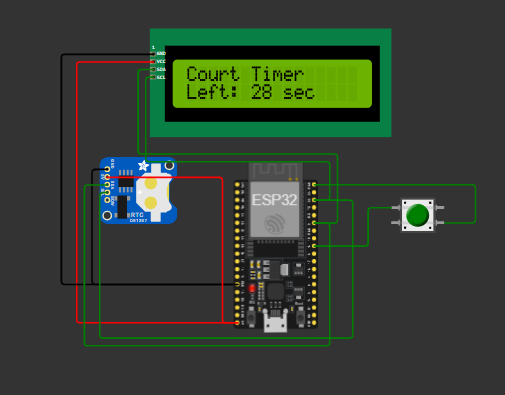

# Smart-Courtroom-Timer-and-Case-Display-System
An ESP32-based Smart Courtroom Timer and Case Display System that automates speaker time management using an IR sensor, RTC, LCD, sound sensor, and push button. The system tracks speakers, displays case details, manages countdown timing, and improves courtroom efficiency.The project integrates an ESP32 microcontroller with an IR sensor, DS3231 Real-Time Clock (RTC), 16×2 I2C LCD display, KY-038 sound sensor, and a push button to provide a simple and reliable solution for managing courtroom proceedings.

## Features

- Real-time date and time display
- Automatic case number management
- Speaker detection using an IR sensor
- Automatic speaker counter
- 2-minute countdown timer for each speaker
- Sound-based timer pause and resume
- LCD display for case and timer information
- ESP32-based embedded implementation
- Simple user interface using a push button

## Hardware Components

- ESP32 DevKit V1
- DS3231 RTC Module
- 16×2 I2C LCD Display
- IR Obstacle Sensor
- KY-038 Sound Sensor
- Push Button
- Breadboard
- Jumper Wires
- USB Power Supply

## Software Requirements

- Arduino IDE
- ESP32 Board Package
- Wire Library
- RTClib Library
- LiquidCrystal_I2C Library

## Working Principle

The **Smart Courtroom Timer and Case Display System** is designed to automate courtroom time management by monitoring speaker activity and displaying real-time case information. The system is built around the **ESP32 microcontroller**, which acts as the central processing unit and coordinates all connected peripherals.

When the system is powered on, the ESP32 initializes the **DS3231 Real-Time Clock (RTC)**, **16×2 I2C LCD**, **IR sensor**, **sound sensor**, and **push button**. The RTC continuously provides the current date and time, which are displayed on the LCD until a new case is initiated.

The **push button** is used to register a new case. Each press increments the case number and prepares the system for the next hearing. The updated case number is immediately displayed on the LCD.

An **IR sensor** is placed near the speaker's position to detect the entry of a participant. Whenever the sensor detects a person, the ESP32 automatically increments the speaker number and starts a predefined countdown timer. This ensures that each speaker receives a fixed and measurable speaking duration.

The **sound sensor** continuously monitors courtroom audio. Based on the programmed threshold, the ESP32 can pause or resume the countdown timer during interruptions such as objections or judicial instructions. This helps maintain accurate timing without manual intervention.

Throughout the proceedings, the LCD continuously displays the **current case number, speaker number, remaining speaking time, and real-time clock**. The ESP32 processes sensor inputs in real time, updates the countdown timer, and refreshes the display accordingly, providing an efficient and transparent courtroom management system.


## System Workflow

```text
                ┌────────────────────┐
                │    Power ON        │
                └─────────┬──────────┘
                          │
                          ▼
        ┌─────────────────────────────────┐
        │ Initialize ESP32 and Peripherals│
        │ • RTC                           │
        │ • LCD                           │
        │ • IR Sensor                     │
        │ • Sound Sensor                  │
        │ • Push Button                   │
        └───────────────┬─────────────────┘
                        │
                        ▼
          ┌──────────────────────────────┐
          │ Display Current Date & Time  │
          └───────────────┬──────────────┘
                          │
                          ▼
          ┌──────────────────────────────┐
          │ Judge Presses Push Button    │
          └───────────────┬──────────────┘
                          │
                          ▼
          ┌──────────────────────────────┐
          │ Increment Case Number        │
          └───────────────┬──────────────┘
                          │
                          ▼
          ┌──────────────────────────────┐
          │ IR Sensor Detects Speaker    │
          └───────────────┬──────────────┘
                          │
                          ▼
          ┌──────────────────────────────┐
          │ Increment Speaker Number     │
          │ Start Countdown Timer        │
          └───────────────┬──────────────┘
                          │
                          ▼
          ┌──────────────────────────────┐
          │ Monitor Sound Sensor         │
          │ Pause / Resume Timer         │
          └───────────────┬──────────────┘
                          │
                          ▼
          ┌──────────────────────────────┐
          │ Update LCD Display           │
          │ • Case Number                │
          │ • Speaker Number             │
          │ • Remaining Time             │
          │ • Date & Time                │
          └───────────────┬──────────────┘
                          │
                          ▼
          ┌──────────────────────────────┐
          │ Wait for Next Speaker / Case │
          └──────────────────────────────┘
```

### Key Operations

- Initializes all hardware components during startup.
- Displays real-time date and time using the DS3231 RTC.
- Registers new cases using a push button.
- Detects speakers automatically using an IR sensor.
- Starts and manages an individual countdown timer for each speaker.
- Monitors courtroom audio using a sound sensor to pause or resume the timer.
- Continuously updates the LCD with live courtroom information.
- Automates courtroom time management, reducing manual effort and improving fairness..


## Simulation

The Smart Courtroom Timer and Case Display System was also designed and tested using the Wokwi simulator. The simulation helped verify the circuit connections, ESP32 program, LCD output, push-button input, speaker-detection logic, and countdown-timer operation before implementing the physical prototype.



### Simulation Files

- `diagram.json` contains the component arrangement and wiring connections.
- `sketch.ino` contains the ESP32 program used in the Wokwi simulation.
- `wokwi diagram.png` contains a screenshot of the simulated circuit.
- `wokwi link.txt` contains the link to the online Wokwi project.

### View Simulation

[Open the Wokwi Simulation](https://wokwi.com/projects/456312737790568449)
## Prototype

The completed hardware prototype of the Smart Courtroom Timer and Case Display System was developed using the ESP32 DevKit V1. It integrates the DS3231 RTC module, 16×2 I2C LCD, IR sensor, KY-038 sound sensor, and push button.

The prototype was tested for real-time clock display, case-number control, speaker detection, countdown timing, and sound-controlled pause and resume operation.


## LCD Output

The 16×2 LCD provides real-time information about the system. During idle operation, it displays the current date and time obtained from the DS3231 RTC module.

During an active courtroom session, the LCD displays information such as the case number, speaker number, countdown timer, timer status, and waiting message for the next speaker.


## Applications

- Courtroom proceedings
- Debate competitions
- Arbitration sessions
- Public hearings
- Academic presentations
- Conference speaker management

## Future Enhancements

- Voice recognition for speaker identification
- Wi-Fi-based monitoring and logging
- Web dashboard for real-time monitoring
- Mobile application integration
- Cloud-based data storage
- Multi-courtroom support

## License

This project is licensed under the MIT License.
